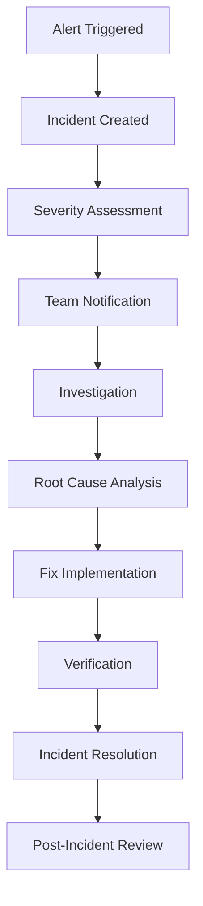

# Al Mazahir Trading - Monitoring Procedures

## Overview

This document outlines comprehensive monitoring procedures for the Al Mazahir Trading platform. Effective monitoring ensures system reliability, performance optimization, and proactive issue resolution.

## Monitoring Architecture

### Monitoring Stack
- **Application Monitoring**: Built-in Next.js monitoring + Custom metrics
- **Infrastructure Monitoring**: Vercel Analytics + Supabase Monitoring
- **Business Monitoring**: Custom analytics and KPI tracking
- **Security Monitoring**: Audit logs and security event tracking
- **User Experience Monitoring**: Real User Monitoring (RUM)

### Data Flow
```
Application → Metrics Collection → Processing → Storage → Alerting → Dashboard
     ↓              ↓                ↓         ↓         ↓         ↓
  Custom Logs → Log Aggregation → Analysis → Database → Alerts → Visualization
```

## Key Performance Indicators (KPIs)

### Technical KPIs

#### Application Performance
- **Response Time**: Average API response time < 500ms
- **Page Load Time**: Complete page load < 3 seconds
- **Error Rate**: Application error rate < 1%
- **Uptime**: System availability > 99.9%
- **Throughput**: Requests per second capacity

#### Infrastructure Metrics
- **CPU Usage**: Average CPU utilization < 70%
- **Memory Usage**: Memory utilization < 80%
- **Database Performance**: Query response time < 100ms
- **Cache Hit Rate**: Cache effectiveness > 90%
- **CDN Performance**: CDN cache hit rate > 95%

### Business KPIs

#### Lead Generation
- **Lead Submission Rate**: Daily lead submissions
- **Conversion Rate**: Lead to customer conversion
- **Source Attribution**: Lead source effectiveness
- **Response Time**: Time to first response
- **Quality Score**: Lead quality assessment

#### User Engagement
- **Page Views**: Daily/monthly page views
- **Session Duration**: Average session length
- **Bounce Rate**: Single-page session rate
- **Return Visitors**: Repeat visitor percentage
- **Feature Usage**: Feature adoption rates

## Monitoring Implementation

### Application Monitoring

#### Performance Monitoring Setup
```typescript
// lib/monitoring/performance.ts
export class PerformanceMonitor {
  private static instance: PerformanceMonitor;
  
  static getInstance(): PerformanceMonitor {
    if (!PerformanceMonitor.instance) {
      PerformanceMonitor.instance = new PerformanceMonitor();
    }
    return PerformanceMonitor.instance;
  }
  
  // Track API response times
  trackAPIResponse(endpoint: string, duration: number, status: number) {
    const metric = {
      timestamp: new Date(),
      endpoint,
      duration,
      status,
      type: 'api_response'
    };
    
    this.sendMetric(metric);
    
    // Alert on slow responses
    if (duration > 3000) {
      this.triggerAlert('slow_api_response', metric);
    }
  }
  
  // Track page load performance
  trackPageLoad(page: string, metrics: WebVitals) {
    const metric = {
      timestamp: new Date(),
      page,
      lcp: metrics.lcp,
      fid: metrics.fid,
      cls: metrics.cls,
      type: 'page_performance'
    };
    
    this.sendMetric(metric);
    
    // Alert on poor Core Web Vitals
    if (metrics.lcp > 2500 || metrics.fid > 100 || metrics.cls > 0.1) {
      this.triggerAlert('poor_web_vitals', metric);
    }
  }
  
  // Track business events
  trackBusinessEvent(event: string, data: any) {
    const metric = {
      timestamp: new Date(),
      event,
      data,
      type: 'business_event'
    };
    
    this.sendMetric(metric);
  }
  
  private sendMetric(metric: any) {
    // Send to monitoring service
    fetch('/api/monitoring/metrics', {
      method: 'POST',
      headers: { 'Content-Type': 'application/json' },
      body: JSON.stringify(metric)
    });
  }
  
  private triggerAlert(type: string, data: any) {
    fetch('/api/monitoring/alerts', {
      method: 'POST',
      headers: { 'Content-Type': 'application/json' },
      body: JSON.stringify({ type, data, timestamp: new Date() })
    });
  }
}
```

#### Error Monitoring
```typescript
// lib/monitoring/error-tracking.ts
export class ErrorTracker {
  static trackError(error: Error, context?: any) {
    const errorData = {
      message: error.message,
      stack: error.stack,
      timestamp: new Date(),
      context,
      url: window?.location?.href,
      userAgent: navigator?.userAgent
    };
    
    // Send to error tracking service
    fetch('/api/monitoring/errors', {
      method: 'POST',
      headers: { 'Content-Type': 'application/json' },
      body: JSON.stringify(errorData)
    });
    
    // Trigger alert for critical errors
    if (this.isCriticalError(error)) {
      this.triggerCriticalAlert(errorData);
    }
  }
  
  private static isCriticalError(error: Error): boolean {
    const criticalPatterns = [
      /database/i,
      /authentication/i,
      /payment/i,
      /security/i
    ];
    
    return criticalPatterns.some(pattern => 
      pattern.test(error.message) || pattern.test(error.stack || '')
    );
  }
  
  private static triggerCriticalAlert(errorData: any) {
    fetch('/api/monitoring/alerts/critical', {
      method: 'POST',
      headers: { 'Content-Type': 'application/json' },
      body: JSON.stringify({
        type: 'critical_error',
        data: errorData,
        severity: 'critical'
      })
    });
  }
}
```

### Database Monitoring

#### Database Performance Queries
```sql
-- Monitor slow queries
SELECT 
  query,
  calls,
  total_time,
  mean_time,
  max_time,
  stddev_time
FROM pg_stat_statements 
WHERE mean_time > 1000  -- queries taking more than 1 second
ORDER BY mean_time DESC 
LIMIT 20;

-- Monitor database connections
SELECT 
  count(*) as total_connections,
  count(*) FILTER (WHERE state = 'active') as active_connections,
  count(*) FILTER (WHERE state = 'idle') as idle_connections
FROM pg_stat_activity;

-- Monitor table sizes
SELECT 
  schemaname,
  tablename,
  pg_size_pretty(pg_total_relation_size(schemaname||'.'||tablename)) as size,
  pg_total_relation_size(schemaname||'.'||tablename) as size_bytes
FROM pg_tables 
WHERE schemaname = 'public'
ORDER BY size_bytes DESC;

-- Monitor index usage
SELECT 
  schemaname,
  tablename,
  indexname,
  idx_scan,
  idx_tup_read,
  idx_tup_fetch
FROM pg_stat_user_indexes
WHERE idx_scan = 0  -- unused indexes
ORDER BY schemaname, tablename;
```

#### Database Monitoring Script
```bash
#!/bin/bash
# scripts/monitor-database.sh

echo "🗄️ Monitoring database performance..."

# Check connection count
CONNECTION_COUNT=$(psql $DATABASE_URL -t -c "SELECT count(*) FROM pg_stat_activity;")
echo "Active connections: $CONNECTION_COUNT"

if [ $CONNECTION_COUNT -gt 80 ]; then
  echo "⚠️ High connection count detected"
  # Trigger alert
  curl -X POST /api/monitoring/alerts -d '{"type":"high_db_connections","count":'$CONNECTION_COUNT'}'
fi

# Check for slow queries
SLOW_QUERIES=$(psql $DATABASE_URL -t -c "SELECT count(*) FROM pg_stat_statements WHERE mean_time > 1000;")
echo "Slow queries: $SLOW_QUERIES"

if [ $SLOW_QUERIES -gt 5 ]; then
  echo "⚠️ Multiple slow queries detected"
  # Trigger alert
  curl -X POST /api/monitoring/alerts -d '{"type":"slow_queries","count":'$SLOW_QUERIES'}'
fi

# Check database size
DB_SIZE=$(psql $DATABASE_URL -t -c "SELECT pg_size_pretty(pg_database_size(current_database()));")
echo "Database size: $DB_SIZE"

echo "✅ Database monitoring completed"
```

### Security Monitoring

#### Security Event Tracking
```typescript
// lib/monitoring/security.ts
export class SecurityMonitor {
  static trackSecurityEvent(event: SecurityEvent) {
    const securityData = {
      type: event.type,
      severity: event.severity,
      timestamp: new Date(),
      userId: event.userId,
      ipAddress: event.ipAddress,
      userAgent: event.userAgent,
      details: event.details
    };
    
    // Log security event
    this.logSecurityEvent(securityData);
    
    // Trigger alerts for high-severity events
    if (event.severity === 'high' || event.severity === 'critical') {
      this.triggerSecurityAlert(securityData);
    }
    
    // Check for patterns
    this.checkSecurityPatterns(securityData);
  }
  
  private static logSecurityEvent(data: any) {
    fetch('/api/monitoring/security/events', {
      method: 'POST',
      headers: { 'Content-Type': 'application/json' },
      body: JSON.stringify(data)
    });
  }
  
  private static triggerSecurityAlert(data: any) {
    fetch('/api/monitoring/alerts/security', {
      method: 'POST',
      headers: { 'Content-Type': 'application/json' },
      body: JSON.stringify({
        type: 'security_event',
        data,
        severity: data.severity
      })
    });
  }
  
  private static async checkSecurityPatterns(data: any) {
    // Check for brute force attempts
    if (data.type === 'failed_login') {
      const recentFailures = await this.getRecentFailedLogins(data.ipAddress);
      if (recentFailures > 5) {
        this.triggerSecurityAlert({
          ...data,
          type: 'brute_force_attempt',
          severity: 'high'
        });
      }
    }
    
    // Check for suspicious activity patterns
    if (data.type === 'suspicious_activity') {
      this.triggerSecurityAlert({
        ...data,
        severity: 'medium'
      });
    }
  }
  
  private static async getRecentFailedLogins(ipAddress: string): Promise<number> {
    const response = await fetch(`/api/monitoring/security/failed-logins?ip=${ipAddress}&hours=1`);
    const data = await response.json();
    return data.count;
  }
}

interface SecurityEvent {
  type: 'failed_login' | 'suspicious_activity' | 'unauthorized_access' | 'data_breach';
  severity: 'low' | 'medium' | 'high' | 'critical';
  userId?: string;
  ipAddress: string;
  userAgent: string;
  details: any;
}
```

## Alert Configuration

### Alert Types and Thresholds

#### Performance Alerts
```typescript
// config/alerts.ts
export const performanceAlerts = [
  {
    name: 'High Response Time',
    metric: 'avg_response_time',
    threshold: 3000,
    operator: '>',
    severity: 'warning',
    channels: ['slack'],
    cooldown: 300 // 5 minutes
  },
  {
    name: 'Critical Response Time',
    metric: 'avg_response_time',
    threshold: 5000,
    operator: '>',
    severity: 'critical',
    channels: ['email', 'slack', 'sms'],
    cooldown: 60 // 1 minute
  },
  {
    name: 'High Error Rate',
    metric: 'error_rate',
    threshold: 0.05,
    operator: '>',
    severity: 'critical',
    channels: ['email', 'slack'],
    cooldown: 300
  },
  {
    name: 'Low Uptime',
    metric: 'uptime',
    threshold: 0.99,
    operator: '<',
    severity: 'critical',
    channels: ['email', 'slack', 'sms'],
    cooldown: 60
  }
];
```

#### Business Alerts
```typescript
export const businessAlerts = [
  {
    name: 'Low Lead Submission Rate',
    metric: 'daily_leads',
    threshold: 5,
    operator: '<',
    severity: 'warning',
    channels: ['email'],
    cooldown: 3600 // 1 hour
  },
  {
    name: 'High Bounce Rate',
    metric: 'bounce_rate',
    threshold: 0.7,
    operator: '>',
    severity: 'warning',
    channels: ['slack'],
    cooldown: 1800 // 30 minutes
  },
  {
    name: 'Conversion Rate Drop',
    metric: 'conversion_rate',
    threshold: 0.1,
    operator: '<',
    severity: 'medium',
    channels: ['email', 'slack'],
    cooldown: 3600
  }
];
```

#### Security Alerts
```typescript
export const securityAlerts = [
  {
    name: 'Failed Login Attempts',
    metric: 'failed_logins_per_hour',
    threshold: 10,
    operator: '>',
    severity: 'medium',
    channels: ['email', 'slack'],
    cooldown: 1800
  },
  {
    name: 'Brute Force Attack',
    metric: 'failed_logins_per_ip',
    threshold: 5,
    operator: '>',
    severity: 'high',
    channels: ['email', 'slack', 'sms'],
    cooldown: 300
  },
  {
    name: 'Suspicious Activity',
    metric: 'suspicious_events',
    threshold: 0,
    operator: '>',
    severity: 'high',
    channels: ['email', 'slack'],
    cooldown: 600
  }
];
```

### Alert Management

#### Alert Processing System
```typescript
// lib/monitoring/alert-manager.ts
export class AlertManager {
  private static cooldowns = new Map<string, number>();
  
  static async processAlert(alert: Alert) {
    // Check cooldown
    if (this.isInCooldown(alert)) {
      return;
    }
    
    // Validate alert
    if (!this.validateAlert(alert)) {
      return;
    }
    
    // Send notifications
    await this.sendNotifications(alert);
    
    // Set cooldown
    this.setCooldown(alert);
    
    // Log alert
    this.logAlert(alert);
  }
  
  private static isInCooldown(alert: Alert): boolean {
    const key = `${alert.name}_${alert.severity}`;
    const lastTriggered = this.cooldowns.get(key);
    
    if (!lastTriggered) return false;
    
    const cooldownPeriod = alert.cooldown * 1000; // Convert to milliseconds
    return Date.now() - lastTriggered < cooldownPeriod;
  }
  
  private static validateAlert(alert: Alert): boolean {
    // Validate alert structure
    if (!alert.name || !alert.severity || !alert.channels) {
      return false;
    }
    
    // Validate severity level
    const validSeverities = ['low', 'medium', 'high', 'critical'];
    if (!validSeverities.includes(alert.severity)) {
      return false;
    }
    
    return true;
  }
  
  private static async sendNotifications(alert: Alert) {
    const promises = alert.channels.map(channel => {
      switch (channel) {
        case 'email':
          return this.sendEmailAlert(alert);
        case 'slack':
          return this.sendSlackAlert(alert);
        case 'sms':
          return this.sendSMSAlert(alert);
        default:
          console.warn(`Unknown alert channel: ${channel}`);
      }
    });
    
    await Promise.allSettled(promises);
  }
  
  private static setCooldown(alert: Alert) {
    const key = `${alert.name}_${alert.severity}`;
    this.cooldowns.set(key, Date.now());
  }
  
  private static logAlert(alert: Alert) {
    fetch('/api/monitoring/alerts/log', {
      method: 'POST',
      headers: { 'Content-Type': 'application/json' },
      body: JSON.stringify({
        ...alert,
        timestamp: new Date()
      })
    });
  }
}
```

## Monitoring Dashboards

### System Health Dashboard

#### Dashboard Configuration
```typescript
// config/dashboards.ts
export const systemHealthDashboard = {
  name: 'System Health',
  refreshInterval: 30, // seconds
  widgets: [
    {
      type: 'metric',
      title: 'Uptime',
      metric: 'uptime',
      format: 'percentage',
      target: 99.9
    },
    {
      type: 'metric',
      title: 'Response Time',
      metric: 'avg_response_time',
      format: 'milliseconds',
      target: 500
    },
    {
      type: 'metric',
      title: 'Error Rate',
      metric: 'error_rate',
      format: 'percentage',
      target: 1
    },
    {
      type: 'chart',
      title: 'Response Time Trend',
      metric: 'response_time',
      timeRange: '24h',
      chartType: 'line'
    },
    {
      type: 'chart',
      title: 'Error Rate Trend',
      metric: 'error_rate',
      timeRange: '24h',
      chartType: 'area'
    },
    {
      type: 'table',
      title: 'Recent Errors',
      query: 'recent_errors',
      limit: 10
    }
  ]
};
```

### Business Metrics Dashboard

#### Business Dashboard Configuration
```typescript
export const businessDashboard = {
  name: 'Business Metrics',
  refreshInterval: 300, // 5 minutes
  widgets: [
    {
      type: 'metric',
      title: 'Daily Leads',
      metric: 'daily_leads',
      format: 'number',
      comparison: 'yesterday'
    },
    {
      type: 'metric',
      title: 'Conversion Rate',
      metric: 'conversion_rate',
      format: 'percentage',
      comparison: 'last_week'
    },
    {
      type: 'metric',
      title: 'Page Views',
      metric: 'daily_page_views',
      format: 'number',
      comparison: 'yesterday'
    },
    {
      type: 'chart',
      title: 'Lead Submissions',
      metric: 'lead_submissions',
      timeRange: '7d',
      chartType: 'bar'
    },
    {
      type: 'chart',
      title: 'Traffic Sources',
      metric: 'traffic_sources',
      timeRange: '7d',
      chartType: 'pie'
    },
    {
      type: 'table',
      title: 'Top Performing Categories',
      query: 'top_categories',
      limit: 5
    }
  ]
};
```

## Incident Response Procedures

### Incident Classification

#### Severity Levels
- **Critical (P1)**: Complete system outage, data loss, security breach
- **High (P2)**: Major functionality impaired, significant user impact
- **Medium (P3)**: Minor functionality issues, limited user impact
- **Low (P4)**: Cosmetic issues, no user impact

#### Response Times
- **P1**: 15 minutes
- **P2**: 1 hour
- **P3**: 4 hours
- **P4**: 24 hours

### Incident Response Process

#### Incident Response Workflow


#### Incident Response Script
```bash
#!/bin/bash
# scripts/incident-response.sh

SEVERITY=$1
DESCRIPTION=$2

if [ -z "$SEVERITY" ] || [ -z "$DESCRIPTION" ]; then
  echo "Usage: $0 <severity> <description>"
  echo "Severity: critical, high, medium, low"
  exit 1
fi

echo "🚨 Incident Response Initiated"
echo "Severity: $SEVERITY"
echo "Description: $DESCRIPTION"

# Create incident record
INCIDENT_ID=$(curl -s -X POST /api/monitoring/incidents \
  -H "Content-Type: application/json" \
  -d "{\"severity\":\"$SEVERITY\",\"description\":\"$DESCRIPTION\"}" \
  | jq -r '.incidentId')

echo "Incident ID: $INCIDENT_ID"

# Notify team based on severity
case $SEVERITY in
  "critical")
    echo "📞 Notifying on-call team immediately"
    ./scripts/notify-oncall.sh "$INCIDENT_ID" "$DESCRIPTION"
    ;;
  "high")
    echo "📧 Notifying team via email and Slack"
    ./scripts/notify-team.sh "$INCIDENT_ID" "$DESCRIPTION"
    ;;
  "medium"|"low")
    echo "💬 Creating Slack notification"
    ./scripts/notify-slack.sh "$INCIDENT_ID" "$DESCRIPTION"
    ;;
esac

# Start incident tracking
echo "📊 Starting incident tracking..."
./scripts/track-incident.sh "$INCIDENT_ID" &

echo "✅ Incident response initiated successfully"
echo "Track progress at: https://almazahir.com/admin/monitoring/incidents/$INCIDENT_ID"
```

## Monitoring Automation

### Automated Monitoring Scripts

#### Health Check Automation
```bash
#!/bin/bash
# scripts/automated-health-check.sh

echo "🤖 Running automated health check..."

# Check application health
APP_HEALTH=$(curl -s -o /dev/null -w "%{http_code}" https://almazahir.com/api/health)
if [ $APP_HEALTH -ne 200 ]; then
  echo "❌ Application health check failed"
  ./scripts/incident-response.sh "critical" "Application health check failed"
fi

# Check database health
DB_HEALTH=$(curl -s -o /dev/null -w "%{http_code}" https://almazahir.com/api/health/database)
if [ $DB_HEALTH -ne 200 ]; then
  echo "❌ Database health check failed"
  ./scripts/incident-response.sh "critical" "Database health check failed"
fi

# Check external services
EXTERNAL_HEALTH=$(curl -s -o /dev/null -w "%{http_code}" https://almazahir.com/api/health/external)
if [ $EXTERNAL_HEALTH -ne 200 ]; then
  echo "⚠️ External services health check failed"
  ./scripts/incident-response.sh "medium" "External services health check failed"
fi

echo "✅ Automated health check completed"
```

#### Performance Monitoring Automation
```bash
#!/bin/bash
# scripts/automated-performance-check.sh

echo "📊 Running automated performance check..."

# Check response times
RESPONSE_TIME=$(curl -s -w "%{time_total}" -o /dev/null https://almazahir.com/)
RESPONSE_TIME_MS=$(echo "$RESPONSE_TIME * 1000" | bc)

if (( $(echo "$RESPONSE_TIME_MS > 3000" | bc -l) )); then
  echo "⚠️ Slow response time detected: ${RESPONSE_TIME_MS}ms"
  ./scripts/incident-response.sh "medium" "Slow response time: ${RESPONSE_TIME_MS}ms"
fi

# Check Core Web Vitals
npm run performance:check-vitals

# Generate performance report
npm run performance:generate-report

echo "✅ Automated performance check completed"
```

### Monitoring Cron Jobs

#### Crontab Configuration
```bash
# /etc/crontab - Monitoring automation

# Health checks every 5 minutes
*/5 * * * * /path/to/scripts/automated-health-check.sh

# Performance checks every 15 minutes
*/15 * * * * /path/to/scripts/automated-performance-check.sh

# Security monitoring every hour
0 * * * * /path/to/scripts/security-monitoring.sh

# Daily reports at 6 AM
0 6 * * * /path/to/scripts/daily-report.sh

# Weekly reports on Mondays at 8 AM
0 8 * * 1 /path/to/scripts/weekly-report.sh

# Monthly reports on the 1st at 9 AM
0 9 1 * * /path/to/scripts/monthly-report.sh
```

## Monitoring Best Practices

### Implementation Best Practices
1. **Monitor What Matters**: Focus on metrics that impact users and business
2. **Set Realistic Thresholds**: Avoid alert fatigue with appropriate thresholds
3. **Implement Gradual Alerting**: Use warning and critical levels
4. **Document Everything**: Maintain clear documentation for all monitoring
5. **Regular Review**: Regularly review and update monitoring configurations

### Operational Best Practices
1. **Proactive Monitoring**: Monitor trends, not just current state
2. **Correlation Analysis**: Look for patterns across different metrics
3. **Regular Testing**: Test monitoring and alerting systems regularly
4. **Team Training**: Ensure team understands monitoring tools and procedures
5. **Continuous Improvement**: Regularly improve monitoring based on incidents

---

*This monitoring procedures document should be reviewed and updated monthly to ensure it remains effective and current with system changes.*