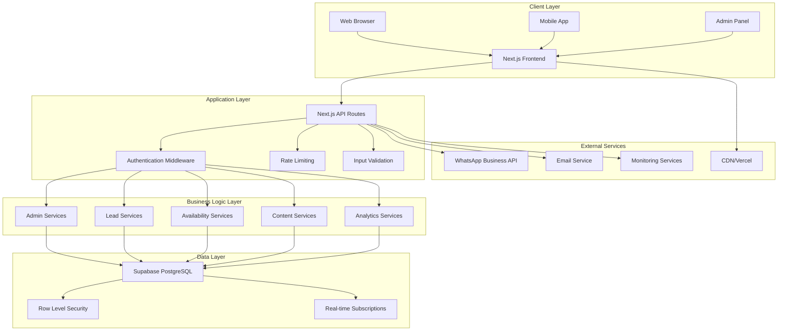

# Al Mazahir Trading - Technical Architecture Documentation

## System Overview

The Al Mazahir Trading platform is an enterprise-grade industrial trading website built on Next.js with a dynamic enhancement layer that transforms static content into an intelligent B2B platform. The architecture follows modern web development best practices with a focus on performance, security, and scalability.

## Architecture Diagram



## Technology Stack

### Frontend Technologies
- **Next.js 14**: React framework with App Router
- **TypeScript**: Type-safe JavaScript development
- **Tailwind CSS**: Utility-first CSS framework
- **React Hook Form**: Form handling and validation
- **Zod**: Schema validation library
- **Framer Motion**: Animation library (optional)

### Backend Technologies
- **Next.js API Routes**: Serverless API endpoints
- **Supabase**: Backend-as-a-Service platform
- **PostgreSQL**: Primary database
- **Node.js**: Runtime environment
- **JWT**: Authentication tokens

### Infrastructure
- **Vercel**: Hosting and deployment platform
- **Supabase**: Database and authentication hosting
- **CDN**: Global content delivery
- **GitHub Actions**: CI/CD pipeline

### Development Tools
- **ESLint**: Code linting
- **Prettier**: Code formatting
- **Jest**: Unit testing framework
- **fast-check**: Property-based testing
- **TypeScript**: Static type checking

## System Architecture

### Frontend Architecture

#### Component Structure
```
src/
├── app/                    # Next.js App Router
│   ├── (public)/          # Public pages
│   ├── admin/             # Admin panel pages
│   └── api/               # API routes
├── components/            # Reusable components
│   ├── ui/               # Base UI components
│   ├── sections/         # Page sections
│   └── layout/           # Layout components
├── lib/                  # Utility libraries
│   ├── hooks/            # Custom React hooks
│   ├── services/         # Business logic
│   ├── types/            # TypeScript definitions
│   └── utils/            # Helper functions
└── styles/               # Global styles
```

#### State Management
- **React State**: Local component state
- **Context API**: Global state for authentication and feature flags
- **SWR/React Query**: Server state management
- **Local Storage**: Client-side persistence

#### Routing Strategy
- **App Router**: Next.js 14 App Router for file-based routing
- **Dynamic Routes**: For category and content pages
- **Protected Routes**: Admin panel with authentication middleware
- **API Routes**: RESTful API endpoints

### Backend Architecture

#### API Design
- **RESTful APIs**: Standard HTTP methods and status codes
- **Consistent Response Format**: Standardized JSON responses
- **Error Handling**: Comprehensive error handling and logging
- **Rate Limiting**: Protection against abuse
- **Input Validation**: Zod schema validation

#### Authentication & Authorization
- **Supabase Auth**: Built-in authentication system
- **JWT Tokens**: Secure token-based authentication
- **Row Level Security**: Database-level access control
- **Role-Based Access**: Admin and manager roles
- **Session Management**: Secure session handling

#### Data Layer
- **PostgreSQL**: Primary database with ACID compliance
- **Supabase**: Database hosting and management
- **Real-time Subscriptions**: Live data updates
- **Connection Pooling**: Efficient database connections
- **Migrations**: Version-controlled schema changes

## Database Schema

### Core Tables

#### Product Categories
```sql
CREATE TABLE product_categories (
  id UUID PRIMARY KEY DEFAULT gen_random_uuid(),
  name VARCHAR(255) NOT NULL,
  slug VARCHAR(255) UNIQUE NOT NULL,
  description TEXT,
  image_url VARCHAR(500),
  display_order INTEGER DEFAULT 0,
  is_active BOOLEAN DEFAULT true,
  created_at TIMESTAMP WITH TIME ZONE DEFAULT NOW(),
  updated_at TIMESTAMP WITH TIME ZONE DEFAULT NOW()
);
```

#### Availability Status
```sql
CREATE TABLE availability_status (
  id UUID PRIMARY KEY DEFAULT gen_random_uuid(),
  category_id UUID REFERENCES product_categories(id) ON DELETE CASCADE,
  status availability_enum NOT NULL,
  last_updated TIMESTAMP WITH TIME ZONE DEFAULT NOW(),
  updated_by UUID REFERENCES auth.users(id),
  admin_override BOOLEAN DEFAULT false,
  notes TEXT,
  created_at TIMESTAMP WITH TIME ZONE DEFAULT NOW()
);

CREATE TYPE availability_enum AS ENUM (
  'in_stock',
  'limited',
  'out_of_stock',
  'on_order'
);
```

#### Enhanced Leads
```sql
CREATE TABLE enhanced_leads (
  id UUID PRIMARY KEY DEFAULT gen_random_uuid(),
  name VARCHAR(255) NOT NULL,
  company VARCHAR(255),
  phone VARCHAR(50),
  email VARCHAR(255) NOT NULL,
  product_category UUID REFERENCES product_categories(id),
  urgency urgency_enum NOT NULL,
  quantity_estimate VARCHAR(255),
  message TEXT,
  source_section VARCHAR(100),
  device_type device_enum,
  user_agent TEXT,
  referrer VARCHAR(500),
  ip_address INET,
  status lead_status_enum DEFAULT 'new',
  assigned_to UUID REFERENCES auth.users(id),
  created_at TIMESTAMP WITH TIME ZONE DEFAULT NOW(),
  updated_at TIMESTAMP WITH TIME ZONE DEFAULT NOW()
);
```

#### Feature Flags
```sql
CREATE TABLE feature_flags (
  id UUID PRIMARY KEY DEFAULT gen_random_uuid(),
  name VARCHAR(255) UNIQUE NOT NULL,
  description TEXT,
  is_enabled BOOLEAN DEFAULT false,
  rollout_percentage INTEGER DEFAULT 0,
  target_audience JSONB,
  created_by UUID REFERENCES auth.users(id),
  created_at TIMESTAMP WITH TIME ZONE DEFAULT NOW(),
  updated_at TIMESTAMP WITH TIME ZONE DEFAULT NOW()
);
```

#### Audit Log
```sql
CREATE TABLE audit_log (
  id UUID PRIMARY KEY DEFAULT gen_random_uuid(),
  user_id UUID REFERENCES auth.users(id),
  action VARCHAR(100) NOT NULL,
  resource_type VARCHAR(100) NOT NULL,
  resource_id UUID,
  old_values JSONB,
  new_values JSONB,
  ip_address INET,
  user_agent TEXT,
  created_at TIMESTAMP WITH TIME ZONE DEFAULT NOW()
);
```

### Indexes and Performance
```sql
-- Performance indexes
CREATE INDEX idx_availability_category ON availability_status(category_id);
CREATE INDEX idx_leads_created_at ON enhanced_leads(created_at DESC);
CREATE INDEX idx_leads_status ON enhanced_leads(status);
CREATE INDEX idx_audit_log_user_action ON audit_log(user_id, action);
CREATE INDEX idx_audit_log_created_at ON audit_log(created_at DESC);

-- Full-text search indexes
CREATE INDEX idx_leads_search ON enhanced_leads USING gin(to_tsvector('english', name || ' ' || company || ' ' || message));
```

## API Documentation

### Public APIs

#### GET /api/availability
Returns current availability status for all product categories.

**Response:**
```json
{
  "success": true,
  "data": {
    "category-id-1": {
      "status": "in_stock",
      "lastUpdated": "2024-01-15T10:30:00Z"
    }
  },
  "cached": true,
  "cacheExpiry": "2024-01-15T10:35:00Z"
}
```

#### POST /api/public/leads
Submits a new lead inquiry.

**Request:**
```json
{
  "name": "John Doe",
  "company": "ABC Construction",
  "email": "john@abc.com",
  "phone": "+966501234567",
  "productCategory": "construction-materials",
  "urgency": "immediate",
  "quantityEstimate": "100 bags",
  "message": "Need cement for urgent project",
  "sourceSection": "hero"
}
```

**Response:**
```json
{
  "success": true,
  "leadId": "lead-uuid",
  "message": "Lead submitted successfully",
  "whatsappUrl": "https://wa.me/966501234567?text=..."
}
```

### Admin APIs

#### PUT /api/admin/availability/:categoryId
Updates availability status for a specific category.

**Request:**
```json
{
  "status": "limited",
  "notes": "Low stock, reorder scheduled",
  "adminOverride": false
}
```

#### GET /api/admin/leads
Retrieves leads with filtering and pagination.

**Query Parameters:**
- `page`: Page number (default: 1)
- `limit`: Items per page (default: 20)
- `status`: Filter by lead status
- `category`: Filter by product category
- `dateFrom`: Start date filter
- `dateTo`: End date filter

#### GET /api/admin/dashboard-stats
Returns dashboard statistics and metrics.

**Response:**
```json
{
  "success": true,
  "data": {
    "totalLeads": 150,
    "newLeads": 12,
    "conversionRate": 0.23,
    "availableCategories": 6,
    "systemHealth": "healthy"
  }
}
```

## Security Architecture

### Authentication Flow
1. User submits credentials to `/api/auth/login`
2. Server validates credentials against Supabase Auth
3. JWT token issued with user claims
4. Token stored in secure HTTP-only cookie
5. Subsequent requests include token for validation

### Authorization Levels
- **Public**: No authentication required
- **Admin**: Requires admin role
- **Manager**: Requires manager or admin role
- **System**: Internal system operations

### Security Measures
- **HTTPS Only**: All communications encrypted
- **Rate Limiting**: API endpoint protection
- **Input Validation**: Zod schema validation
- **SQL Injection Prevention**: Parameterized queries
- **XSS Protection**: Content Security Policy
- **CSRF Protection**: SameSite cookies

### Row Level Security (RLS)
```sql
-- Example RLS policy for leads
CREATE POLICY "Admin can view all leads" ON enhanced_leads
  FOR SELECT USING (
    EXISTS (
      SELECT 1 FROM admin_profiles 
      WHERE id = auth.uid() AND is_active = true
    )
  );
```

## Performance Architecture

### Caching Strategy
- **Static Content**: CDN caching with long TTL
- **Dynamic Content**: ISR with 5-minute revalidation
- **API Responses**: Short-term caching (1-5 minutes)
- **Database Queries**: Connection pooling and query optimization

### Optimization Techniques
- **Code Splitting**: Dynamic imports for admin features
- **Image Optimization**: Next.js Image component
- **Bundle Analysis**: Regular bundle size monitoring
- **Lazy Loading**: Progressive component loading
- **Prefetching**: Strategic resource prefetching

### Monitoring and Metrics
- **Core Web Vitals**: Performance monitoring
- **API Response Times**: Endpoint performance tracking
- **Error Rates**: Error monitoring and alerting
- **Database Performance**: Query performance analysis

## Deployment Architecture

### Environment Structure
```
Production Environment
├── Vercel (Frontend & API)
├── Supabase (Database & Auth)
├── GitHub (Source Control)
└── External Services (Email, WhatsApp)

Staging Environment
├── Vercel Preview (Testing)
├── Supabase Staging (Test Database)
└── Feature Branch Deployments

Development Environment
├── Local Next.js Server
├── Local Supabase (Docker)
└── Development Database
```

### CI/CD Pipeline
```yaml
# .github/workflows/ci-cd.yml
name: CI/CD Pipeline
on:
  push:
    branches: [main, develop]
  pull_request:
    branches: [main]

jobs:
  test:
    runs-on: ubuntu-latest
    steps:
      - uses: actions/checkout@v3
      - uses: actions/setup-node@v3
      - run: npm ci
      - run: npm run test
      - run: npm run build
      
  deploy:
    needs: test
    runs-on: ubuntu-latest
    if: github.ref == 'refs/heads/main'
    steps:
      - uses: actions/checkout@v3
      - uses: amondnet/vercel-action@v20
```

### Feature Flag Deployment
- **Gradual Rollout**: Percentage-based feature activation
- **A/B Testing**: Split testing capabilities
- **Instant Rollback**: Quick feature disabling
- **Environment Targeting**: Environment-specific flags

## Monitoring and Observability

### Application Monitoring
- **Error Tracking**: Comprehensive error logging
- **Performance Monitoring**: Real-time performance metrics
- **User Analytics**: User behavior tracking
- **Business Metrics**: KPI monitoring

### Infrastructure Monitoring
- **Server Health**: Resource utilization monitoring
- **Database Performance**: Query performance tracking
- **API Monitoring**: Endpoint availability and performance
- **Security Monitoring**: Security event tracking

### Alerting System
```typescript
// Alert configuration example
interface AlertConfig {
  name: string;
  condition: string;
  threshold: number;
  severity: 'low' | 'medium' | 'high' | 'critical';
  channels: ('email' | 'slack' | 'sms')[];
}

const alerts: AlertConfig[] = [
  {
    name: 'High Error Rate',
    condition: 'error_rate > threshold',
    threshold: 0.05,
    severity: 'high',
    channels: ['email', 'slack']
  }
];
```

## Scalability Considerations

### Horizontal Scaling
- **Serverless Functions**: Auto-scaling API endpoints
- **CDN Distribution**: Global content delivery
- **Database Scaling**: Supabase auto-scaling
- **Load Balancing**: Automatic traffic distribution

### Vertical Scaling
- **Database Optimization**: Query optimization and indexing
- **Caching Layers**: Multi-level caching strategy
- **Resource Optimization**: Efficient resource utilization
- **Performance Tuning**: Continuous performance optimization

### Future Scaling Plans
- **Microservices**: Service decomposition strategy
- **Database Sharding**: Data partitioning strategy
- **Multi-Region**: Geographic distribution
- **Container Orchestration**: Kubernetes deployment

## Maintenance and Operations

### Regular Maintenance Tasks
- **Database Maintenance**: Index optimization, vacuum operations
- **Security Updates**: Dependency updates and security patches
- **Performance Optimization**: Regular performance reviews
- **Backup Verification**: Backup integrity checks

### Disaster Recovery
- **Backup Strategy**: Automated daily backups
- **Recovery Procedures**: Step-by-step recovery process
- **RTO/RPO Targets**: Recovery time and point objectives
- **Testing**: Regular disaster recovery testing

### Documentation Maintenance
- **API Documentation**: Keep API docs current
- **Architecture Updates**: Update diagrams and descriptions
- **Runbook Updates**: Maintain operational procedures
- **Knowledge Transfer**: Team knowledge sharing

---

*This technical architecture documentation should be reviewed and updated quarterly or when significant system changes are made.*